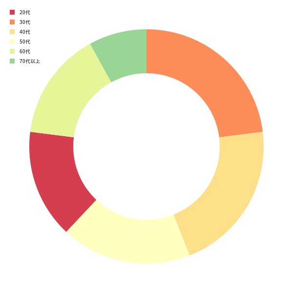

# d3-chart-drawing-demo-on-aws-lambda

D3.jsで描画したグラフをAWS lambda上で描画し、png形式でS3にアップロードするための例

## Requirement

* AWS CLI
* Docker
* terraform

## How it works

1. `infra-sample` 配下 `*.tf` ファイルを参考にAWSリソースを作成する
2. [Noto Sans JP](https://fonts.google.com/noto/specimen/Noto+Sans+JP)フォントを配布元から入手し、 [otf2ttf](https://github.com/awesometoolbox/otf2ttf)などを用いて `.ttf` 形式に変換し、 `/lambda_src/resources/fonts/NotoSansJP-Regular.ttf` に格納する
3. `cd lambda_src` し、 `docker build -t d3-chart-drawing-demo-on-aws-lambda .` を実行しdocker imageをbuildし、任意のECRリポジトリにpushする
4. pushしたimageを参照するlambda関数を作成し、トリガーに任意のS3 Bucketを指定する
5. S3の任意のPATHに `sample/sample.json` をアップロードし、lambdaをキックする
6. 生成された`sample.png` をダウンロードして結果を確認する

## sample

